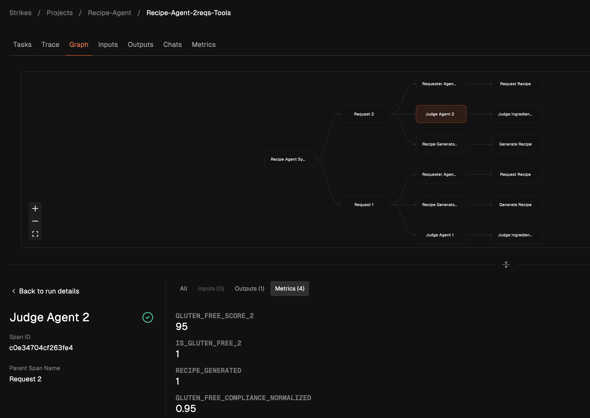
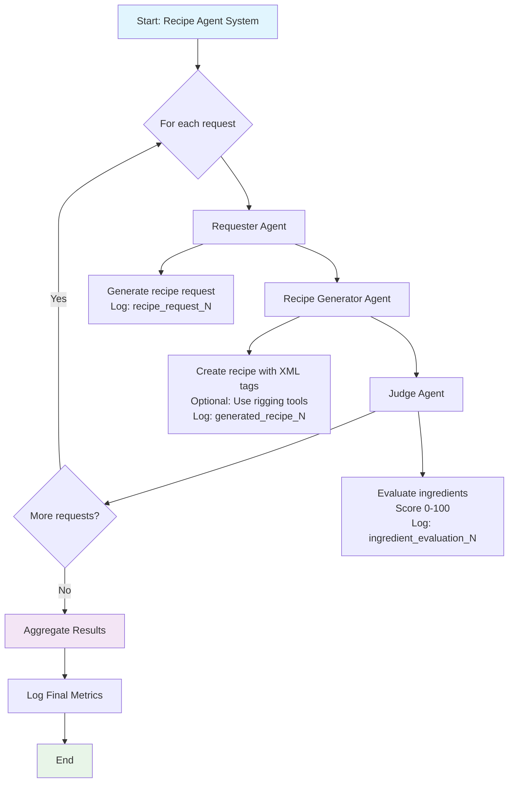

# Recipe Agent 🤌

A multi-agent system for gluten-free banana bread recipe generation and evaluation. Features three specialized agents working together: a requester, recipe generator, and ingredient judge.

<!-- BEGIN_AUTO_BADGES -->
<div align="center">

[](https://github.com/GangGreenTemperTatum/dn-recipe-agent/actions/workflows/pre-commit.yaml)
[](https://github.com/GangGreenTemperTatum/dn-recipe-agent/stargazers)
[](https://github.com/GangGreenTemperTatum/dn-recipe-agent/pulls)

</div>
<!-- END_AUTO_BADGES -->

- [Recipe Agent 🤌](#recipe-agent-)
  - [Setup](#setup)
  - [Basic Usage](#basic-usage)
    - [How It Works](#how-it-works)
    - [Metrics and Scoring](#metrics-and-scoring)
    - [Parameters](#parameters)
    - [Usage Examples](#usage-examples)

<div align="center">



</div>

## Setup

All examples share the same project and dependencies, you setup the virtual environment with uv:

```bash
uv sync
```

See the [setup guide](SETUP_GUIDE.md) for more details on configuring your environment, including Dreadnode API tokens and model keys.

## Basic Usage

```bash
uv run -m recipe_agent --help
```

- Uses rigging models for structured XML recipe output
- Configurable models for each of the three agents (`--recipe-model`, `--judge-model`, `--requester-model`)
- Scores recipes 0-100 for gluten-free compliance via dreadnode metrics
- Judge agent evaluates ingredients and provides detailed feedback
- Optimized with rigging message-level caching for improved performance in batch processing
- Optional rigging tools for ingredient validation and flour substitution recommendations

### How It Works

The system consists of three specialized agents working in sequence:

1. **Requester Agent**: Generates a specific request for a gluten-free banana bread recipe
2. **Recipe Generator Agent**: Creates a complete recipe wrapped in `<recipe>` XML tags using rigging models, including title, ingredients list, and step-by-step instructions
3. **Judge Agent**: Analyzes all ingredients for gluten content, assigns a score from 0-100 (100 = completely gluten-free), identifies problematic ingredients, and suggests gluten-free alternatives if needed



### Metrics and Scoring

The agent tracks comprehensive metrics via Dreadnode for evaluation and analysis:

**Per Request Metrics:**
- **gluten_free_score_{request_num}**: Raw score (0-100) for each recipe using keyword-based analysis
- **is_gluten_free_{request_num}**: Binary pass/fail (1 if score >= 80, 0 otherwise)
- **gluten_free_compliance_normalized**: Normalized score (0-1) for better visualization
- **recipe_generated**: Counter for successful recipe generations
- **tools_enabled/disabled**: Tool usage configuration tracking
- **tool_calls_made**: Number of tools actually called during generation
- **tools_actually_used/available_but_unused**: Tool effectiveness metrics

**Aggregated Run-Level Metrics:**
- **average_score**: Mean gluten-free score across all requests
- **pass_rate**: Percentage of recipes passing the 80+ threshold
- **total_requests**: Total number of requests processed
- **passed_requests**: Number that passed the gluten-free test

**Error Tracking:**
- **system_failed**: Count of system failures
- **max_steps_reached**: When agents hit iteration limits
- **inference_failed**: LLM API failures

**Log Outputs Stored:**
- **recipe_request_{request_num}**: Original requests from requester agent
- **generated_recipe_{request_num}**: Complete recipes with XML tags
- **ingredient_evaluation_{request_num}**: Detailed judge evaluations
- **all_results**: Complete array of all request results (run-level)
- **task_summary**: Final completion summaries for error cases

**Scoring Method:**
Uses a keyword-based algorithm that scans recipe content for gluten-containing ingredients (wheat, flour, barley, etc.), deducting points for problematic terms. Scores range 0-100 where 100 = completely gluten-free, with 80 as the pass/fail threshold. The judge agent provides additional nuanced LLM-based evaluation.

**Run Organization:**
- **Meaningful Names**: Runs are automatically named based on configuration (e.g., `recipe-agent-5reqs-tools`)
- **Dynamic Tagging**: Runs are tagged for easy filtering: `multi-agent`, `recipe-generation`, `tools-enabled`, `batch-processing`
- **Result-Based Tags**: Additional tags applied based on performance: `high-quality-recipes`, `high-success-rate`, etc.
- **Run Attributes**: Model provider, batch size, and configuration flags stored as searchable attributes

### Parameters

```bash
# Required parameters
--recipe-model <model>      # Model for recipe generation
--judge-model <model>       # Model for ingredient evaluation

# Optional parameters
--requester-model <model>   # Model for recipe requests (default: recipe-model)
--num-requests <int>        # Number of requests to process (default: 1)
--enable-caching           # Enable message caching (default: True)
--no-enable-caching        # Disable message caching
--enable-tools             # Enable rigging tools (default: False)
--max-steps <int>          # Max steps per agent (default: 10)
--log-level <level>        # Logging level (default: INFO)

# Dreadnode parameters
--server <url>             # Dreadnode server URL (default: https://platform.dreadnode.io)
--token <token>            # Dreadnode API token (default: $DREADNODE_TOKEN)
--project <name>           # Project name (default: recipe-agent)
--console                  # Show span info in console (default: False)
```

### Usage Examples

```bash
# Basic usage
uv run -m recipe_agent --recipe-model claude-3-5-sonnet-20241022 --judge-model gpt-4o

# Batch processing with tools
uv run -m recipe_agent \
  --recipe-model claude-3-5-sonnet-20241022 \
  --judge-model gpt-4o \
  --num-requests 5 \
  --enable-tools

# Different models per agent
uv run -m recipe_agent \
  --recipe-model claude-3-5-sonnet-20241022 \
  --judge-model gpt-4o \
  --requester-model claude-3-5-haiku-20241022

# Debug mode with custom settings
uv run -m recipe_agent \
  --recipe-model claude-3-5-sonnet-20241022 \
  --judge-model gpt-4o \
  --max-steps 15 \
  --log-level DEBUG \
  --no-enable-caching
```
